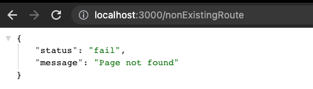

# Documentation 

- [Error Handling](#error-handling)
  - [Unhandled Routes](#unhandled-routes)


# Error Handling


## Unhandled routes

If any of the incoming requests are not matching the app routes, that request will be handled at the middleware function as follows:

```js
app.all('*', (req, res) => {
  res.status(404).json({
    status: 'fail',
    message: 'Page not found',
  });
});
```



This middleware will handle all the requests for all the verbs (`get`, `post`, etc). This middleware must be at the very end of the all other middleware otherwise requests will never pass through this middleware. We will send message that page is not found.

If there is anything passed as argument in `next()`, express will assume that there is an error. If there is anything passed to `next()`, it will skip all other middleware in the app and will jump to the global handler.


